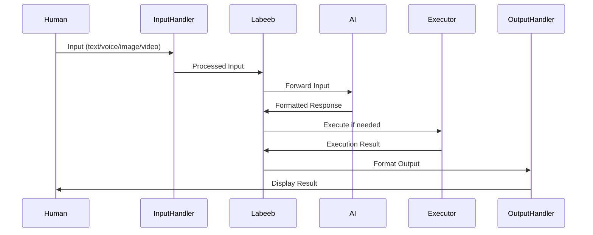
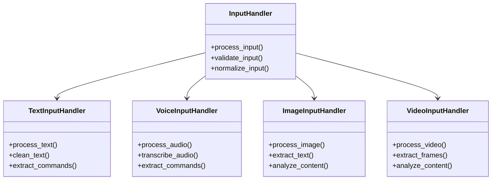
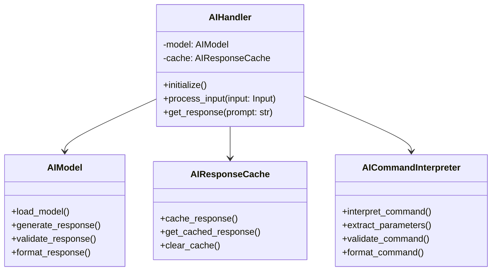
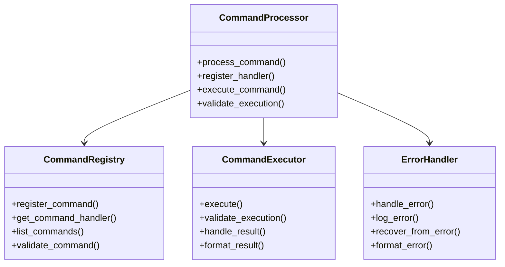
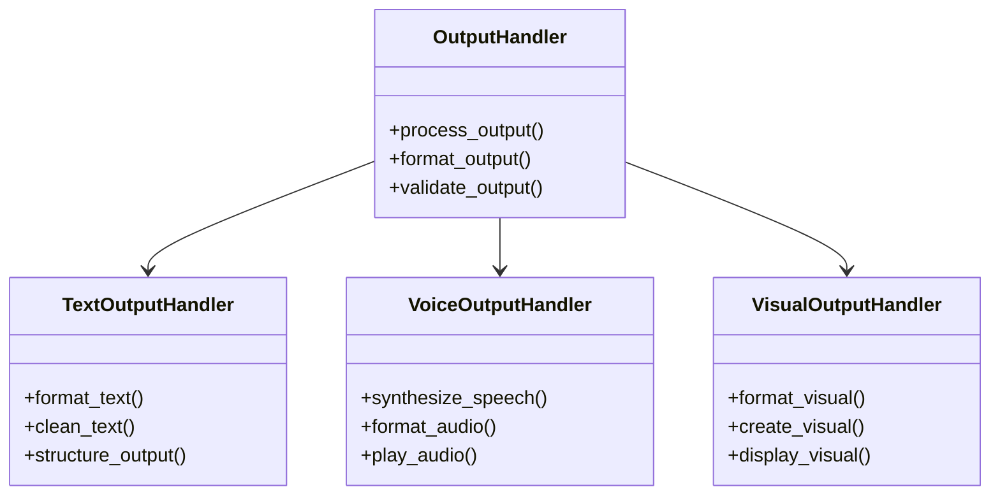
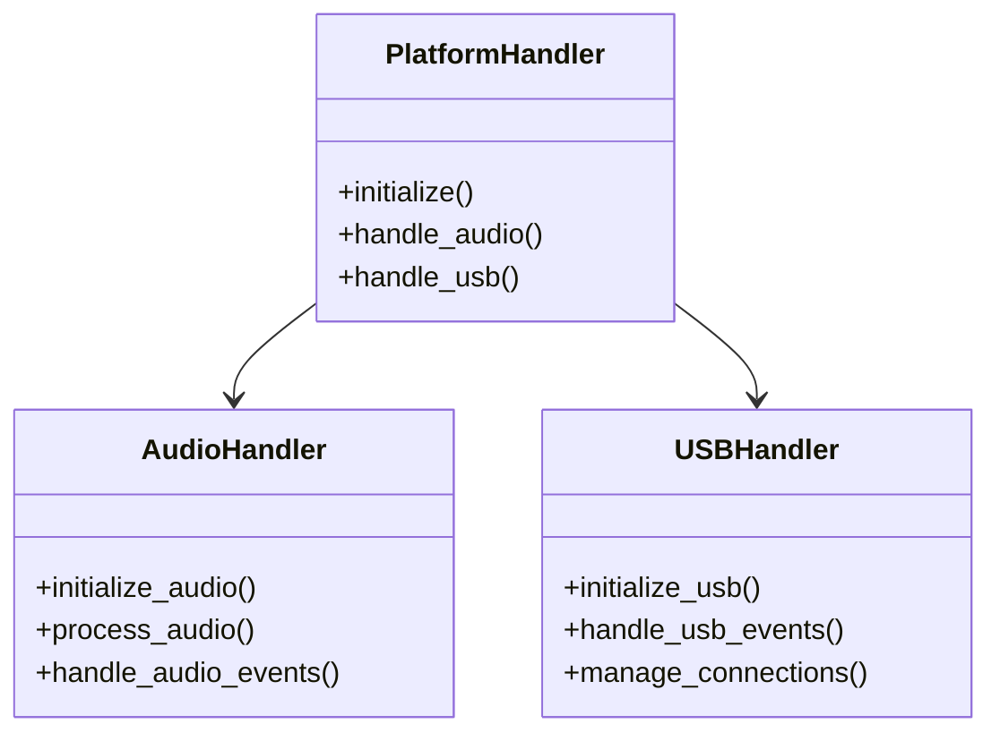
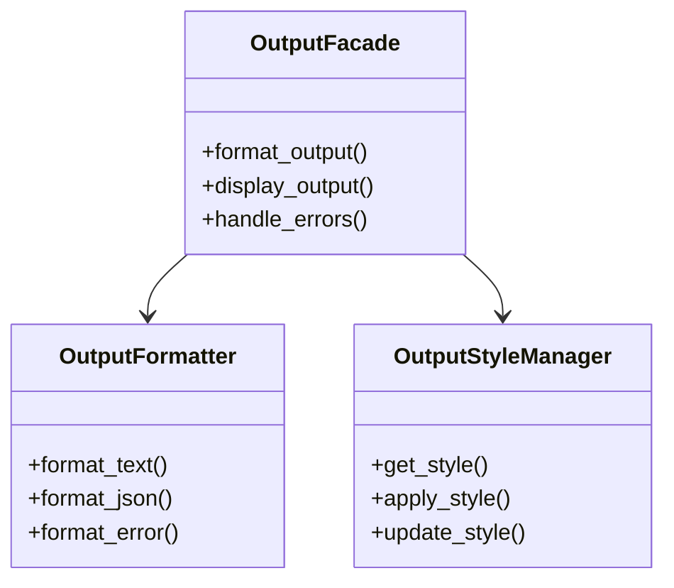
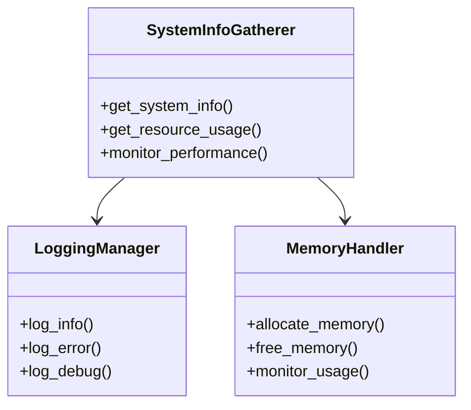
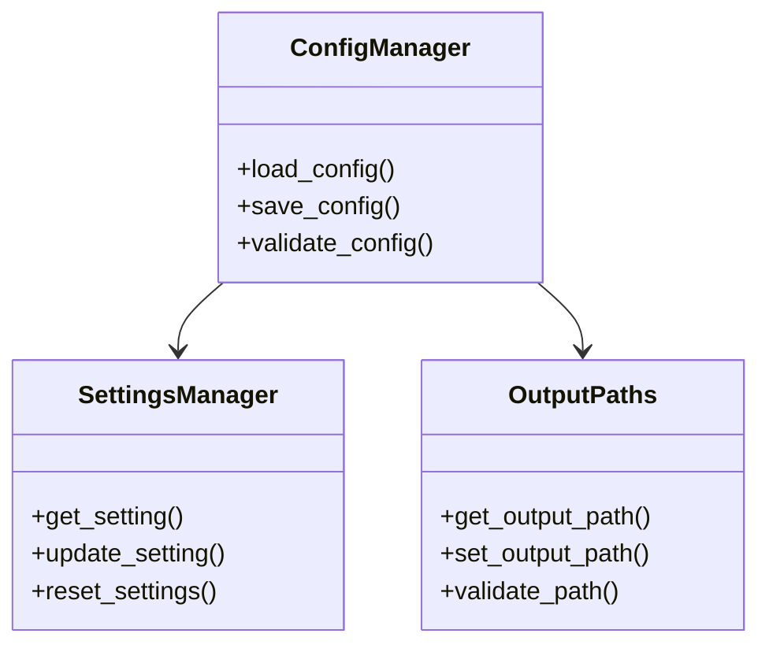

# Labeeb Class Architecture Roadmap

## Overview
This document outlines the class architecture, relationships, and responsibilities of the Labeeb system. The architecture follows a modular design pattern with clear separation of concerns and well-defined interfaces between components.

## Main Flow


## Core Components

### 1. Input Handling Module (`core/input/`)


### 2. AI Module (`core/ai/`)


### 3. Command Processing Module (`core/command_processor/`)


### 4. Output Processing Module (`core/output/`)


## Platform-Specific Components

### Platform Interface (`platform_core/`)


## Utility Components

### 1. Output Management (`utils/`)


### 2. System Utilities (`core/utils/`)


## Configuration Management

### Configuration System (`config/`)


## Class Responsibilities

### 1. AI Module
- `AIHandler`: Main interface for AI operations
- `AIModel`: Manages AI model loading and inference
- `AIResponseCache`: Handles response caching and retrieval
- `AICommandInterpreter`: Interprets and validates AI commands

### 2. Command Processing
- `CommandProcessor`: Orchestrates command execution
- `CommandRegistry`: Manages command registration and lookup
- `CommandExecutor`: Handles actual command execution
- `ErrorHandler`: Manages error handling and recovery

### 3. Device Management
- `DeviceManager`: Coordinates device operations
- `USBDetector`: Handles USB device detection
- `DeviceController`: Controls device operations

### 4. Screen Handling
- `ScreenManager`: Manages screen operations
- `SessionManager`: Handles screen sessions
- `ScreenUtils`: Provides screen-related utilities

## Interface Definitions

### 1. Input Processing Interface
```python
class InputProcessingInterface:
    def process_input(self, input_data: Any) -> ProcessedInput:
        """Process any type of input (text, voice, image, video)."""
        pass
    
    def validate_input(self, input_data: Any) -> bool:
        """Validate the input data."""
        pass
    
    def normalize_input(self, input_data: Any) -> NormalizedInput:
        """Normalize input to a standard format."""
        pass
```

### 2. AI Processing Interface
```python
class AIProcessingInterface:
    def process_input(self, input_data: ProcessedInput) -> AIResponse:
        """Process input and generate AI response."""
        pass
    
    def format_response(self, response: AIResponse) -> FormattedResponse:
        """Format AI response for execution."""
        pass
    
    def validate_response(self, response: AIResponse) -> bool:
        """Validate AI response."""
        pass
```

### 3. Command Execution Interface
```python
class CommandExecutionInterface:
    def execute_command(self, command: FormattedCommand) -> ExecutionResult:
        """Execute a formatted command."""
        pass
    
    def validate_execution(self, result: ExecutionResult) -> bool:
        """Validate execution result."""
        pass
    
    def format_result(self, result: ExecutionResult) -> FormattedResult:
        """Format execution result for output."""
        pass
```

### 4. Output Processing Interface
```python
class OutputProcessingInterface:
    def process_output(self, result: FormattedResult) -> Output:
        """Process and format the final output."""
        pass
    
    def validate_output(self, output: Output) -> bool:
        """Validate the output."""
        pass
    
    def deliver_output(self, output: Output) -> None:
        """Deliver output to the user."""
        pass
```

## Implementation Guidelines

1. **Input Processing**
   - Use natural language processing instead of regex
   - Implement robust input validation
   - Support multiple input formats
   - Handle input normalization

2. **AI Processing**
   - Use semantic analysis for command understanding
   - Implement context-aware processing
   - Support multiple AI models
   - Handle response formatting

3. **Command Execution**
   - Implement safe command execution
   - Support command validation
   - Handle execution results
   - Format execution output

4. **Output Processing**
   - Support multiple output formats
   - Implement output validation
   - Handle output delivery
   - Support user preferences

## Data Flow

1. **Input Flow**
   ```
   Human Input -> Input Handler -> Input Validation -> Input Normalization -> Labeeb
   ```

2. **Processing Flow**
   ```
   Labeeb -> AI Processing -> Command Interpretation -> Command Validation -> Execution
   ```

3. **Output Flow**
   ```
   Execution Result -> Result Formatting -> Output Validation -> Output Delivery -> Human
   ```

## Error Handling

1. **Input Errors**
   - Invalid input format
   - Unsupported input type
   - Input validation failure

2. **Processing Errors**
   - AI processing failure
   - Command interpretation error
   - Validation failure

3. **Execution Errors**
   - Command execution failure
   - Resource unavailability
   - Permission issues

4. **Output Errors**
   - Output formatting failure
   - Delivery failure
   - User feedback issues

## Future Extensions

1. **Enhanced Input Processing**
   - Support for more input types
   - Improved input validation
   - Better input normalization

2. **Advanced AI Processing**
   - Multiple AI model support
   - Context-aware processing
   - Improved response formatting

3. **Extended Command Support**
   - New command types
   - Complex command chains
   - Command templates

4. **Rich Output Support**
   - Interactive output
   - Multi-modal output
   - Custom output formats 